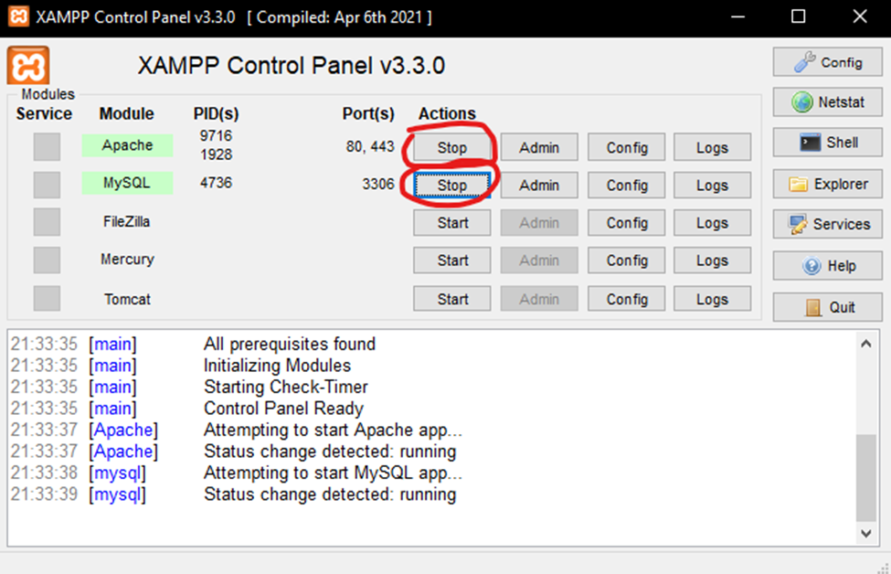

# CV Form in HTML

EN

## 1.What it is

This is a simple CV form made in html that takes user input stores this data in a local database and then redirects the user to a page build with PHP that displays said information.

## 2.Used technologies

This small project uses HTML and PHP and a program called XAMPP.

## 3.How can I access the form

To access this form you first have to download and install XAMPP [here](https://www.apachefriends.org/).

After that you must start the first 2 modules Apache and MySQL like this:

Next navigate to the htdocs folder inside your XAMPP installation folder and add all files from this repository besides this README file.

The final step is to open a browser and enter in the address bar "localhost/CV.html" in order to open the html file.

RO

## 1.Ce este acest proiect

Acesta este un formular CV simplu realizat în html, care preia informatii introduce de utilizator, stochează aceste date într-o bază de date locală și apoi redirecționează utilizatorul către o pagină construită cu PHP care afișează informațiile respective.

## 2.Tehnologii utilizate

Acest mic proiect folosește limbajele de programare HTML și PHP și un program numit XAMPP.

## 3.Cum pot accesa formularul

Pentru a accesa acest formular trebuie mai întâi să descărcați și să instalați XAMPP [aici](https://www.apachefriends.org/).

După aceea, trebuie să porniți primele 2 module Apache și MySQL astfel:

Apoi navigați la folderul htdocs din folderul dvs. de instalare XAMPP și adăugați toate fișierele din acest depozit, în afară de acest fișier README.

In final trebuie să deschideți un browser și să introduceți în bara de adrese „localhost/CV.html" pentru a deschide fișierul html.
